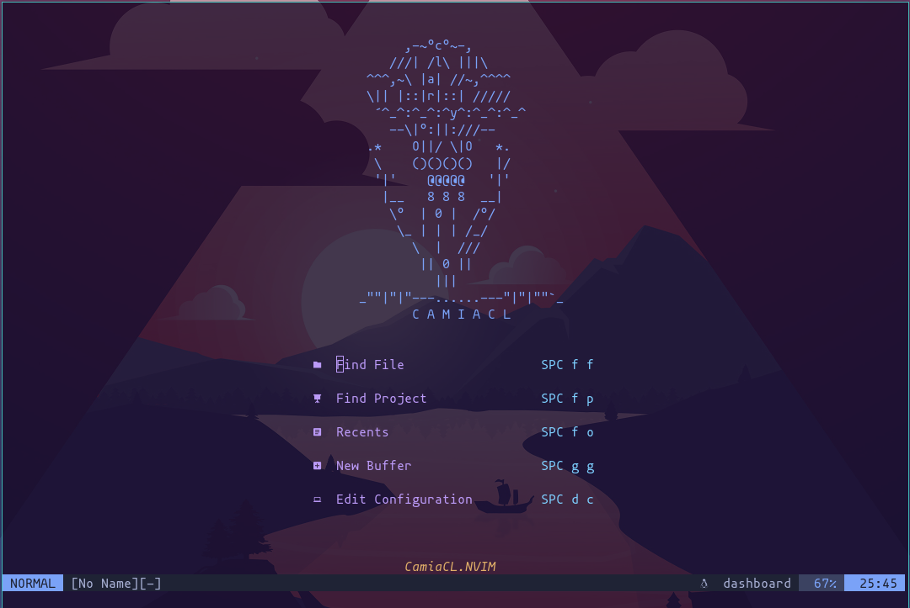
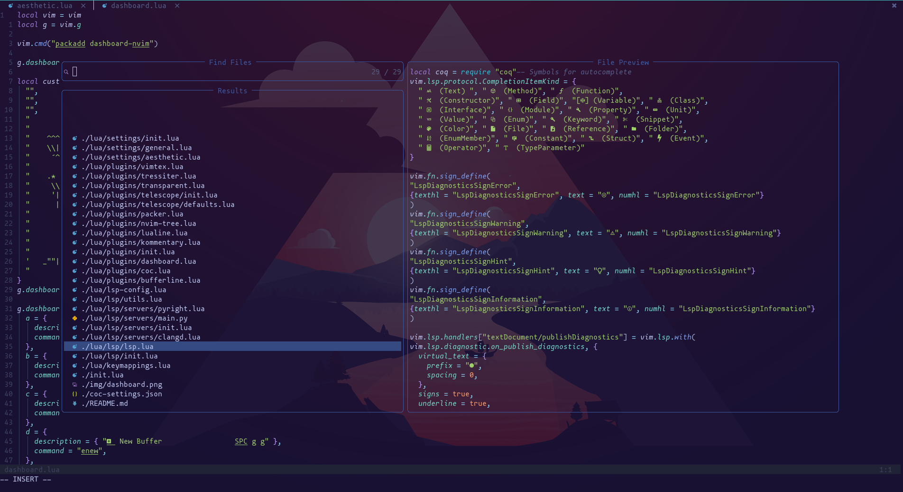

<h1 align="center"> Neovim own configuration :Zzz:</h1>

<p align="center"> A simple Transparent configuration of Nvim </p>

<h2> Directory tree </h2>

`$HOME/.config/nvim`

```
├──  coc-settings.json
├──  init.lua
├──  lua
│   ├──  keymappings.lua
│   ├──  lsp
│   │   ├──  init.lua
│   │   ├──  lsp.lua
│   │   ├──  servers
│   │   │   ├──  clangd.lua
│   │   │   ├──  init.lua
│   │   │   ├──  main.py
│   │   │   └──  pyright.lua
│   │   └──  utils.lua
│   ├──  lsp-config.lua
│   ├──  plugins
│   │   ├──  bufferline.lua
│   │   ├──  coc.lua
│   │   ├──  dashboard.lua
│   │   ├──  init.lua
│   │   ├──  kommentary.lua
│   │   ├──  lualine.lua
│   │   ├──  nvim-tree.lua
│   │   ├──  packer.lua
│   │   ├──  telescope
│   │   │   ├──  defaults.lua
│   │   │   └──  init.lua
│   │   ├──  transparent.lua
│   │   ├──  tressiter.lua
│   │   └──  vimtex.lua
│   └──  settings
│       ├──  aesthetic.lua
│       ├──  general.lua
│       └──  init.lua
├──  plugin
│   └──  packer_compiled.lua
```
<h2> Media </h2>

<p align="center">

</p>




